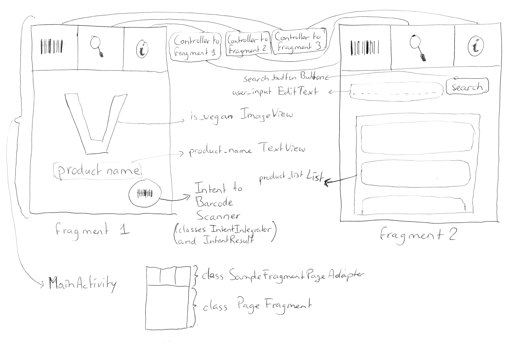

## Minimum Viable Product
The minimum viable product (MVP) consists of one Activity with two fragments, a database of products and an Intent to another app (Barcode Scanner). 
In the first fragment, the user can push a button to scan a barcode, after which the app will search in the database for a matching product. If found, the app will show the product name and whether it is vegan or not. If not found, the user can fill in some information and add the product to a different database, after which the product will be validated and added to the main database.
The second fragment has an edittext in which users can enter a query. After pressing the search button, the app will show a list of all matches with that query below. The items in the list will show the product name on a green (vegan) or red (not vegan) background. Each item in the list can be tapped to go to the resultFragment with that product information. If there's only one result, the user will be sent there automatically.

## Optional
The most important optional element would be something to allow the user to contribute to the database, probably by show a button when a product couldn't be found. After tapping this button, the user can fill in the name (and optionally if the product is vegan or not). The user can also add a comment if they want. This way, the database wouldn't depend on being filled by the developer, who now only needs to filter and approve user submissions.  
Other optional elements include pictures of the products, tags of the type of product (searchable), fragments for information (with FAQ, tutorial and feedback), history (last x viewed products) and settings (language, search preferences, sync database, etc).

## Activities and fragments
Activities:
- mainActivity

Fragments (inside mainActivity):
- result_fragment
- search_fragment  
optional:
- info_fragment
- history_fragment
- settings_fragment    

## Classes and methods
Classes IntentIntegrator and IntentResult handle the barcode scanning. These classes are from [Barcode Scanner](https://github.com/zxing/zxing).  
The method initiatescan inside IntentIntegrator calls the barcode scanner.  

Classes PageFragment and SamplePageFragmentAdapter handle the fragments inside mainActivity. These classes are largely based on the code on [this page](https://github.com/codepath/android_guides/wiki/Google-Play-Style-Tabs-using-TabLayout).  
While the code for the three fragments is inside PageFragment for now, they will probably be moved to seperate classes.  

The ResultFragment class will have the following methods:
- **int getData(String scanned_barcode)** which sends a query to the database giving the barcode and returns the index ID.
- **void showResult(Int result_id)** which will display the product name and whether the product is vegan.
- **void startScanner()** which calls the method initiatescan from IntentIntegrator.

The SearchFragment class will have the following methods:
- **void startSearch()** which will get the input entered in the EditText and call getData with it.
- **Array<Int> getData(String user_input)** which sends a query to the database giving (part of) a barcode or product name and returns index IDs for all matches.
- **void createList(Array<Int> data_matches)** which will create a list of product names and whether these products are vegan based on an array of index IDs.
- **void goToResult(Int result_id)** which will send the user to ResultFragment and will call **showResult(result_id)** there.

Inside the mainActivity, the method onActivityResult handles the result of the barcode scanning. The barcode is converted to a String here.

TODO: Add all classes and public methods here after rewriting code.

## APIs and frameworks
This app uses an Intent to the app [Barcode Scanner](https://github.com/zxing/zxing) to scan a barcode.  
This app uses [Parse](https://parse.com/) for its databases.

## Database
The database has the following format:  
Class "Product":

|  objectID  | productBarcode | productName | isVegan |      createdAt      |      updatedAt      |     ACL     |
|:----------:|:--------------:|:-----------:|:-------:|:-------------------:|:-------------------:|:-----------:|
|   STRING   |     STRING     |    STRING   | BOOLEAN |        DATE         |        DATE         |     ACL     |
| aaaAaaAAAa |  101010101010  |  Tangerine  |   true  | Jan 01, 1900, 00:01 | Jan 01, 1900, 00:11 | Public Read |
| ZZzzZzzzZZ |  999999999999  |    Honey    |  false  | Jan 01, 1900, 00:01 | Jan 01, 1900, 00:11 | Public Read |

Class "Submission":

|  objectID  | productBarcode |  productName | isVegan | productComment |      createdAt      |      updatedAt      |          ACL          |
|:----------:|:--------------:|:------------:|:-------:|:--------------:|:-------------------:|:-------------------:|:---------------------:|
|   STRING   |     STRING     |     STRING   |  STRING |     STRING     |        DATE         |        DATE         |          ACL          |
| aaaAaaAAAa |  101010101010  |   Tangerine  |   true  |  It's a fruit  | Jan 01, 1900, 00:01 | Jan 01, 1900, 00:11 | Public Read and Write |
| ZZzzZzzzZZ |  999999999999  |     Honey    |  false  |  Bees make it  | Jan 01, 1900, 00:01 | Jan 01, 1900, 00:11 | Public Read and Write |
| UEIUeiieuE |  000000000000  | Pumpkin Soup | unknown | Could be cream | Jan 01, 1900, 00:01 | Jan 01, 1900, 00:11 | Public Read and Write |

## Advanced UI sketches
