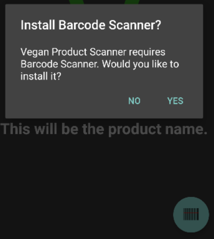
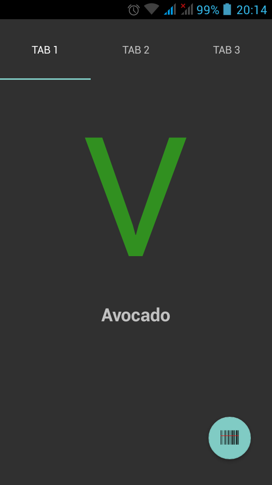
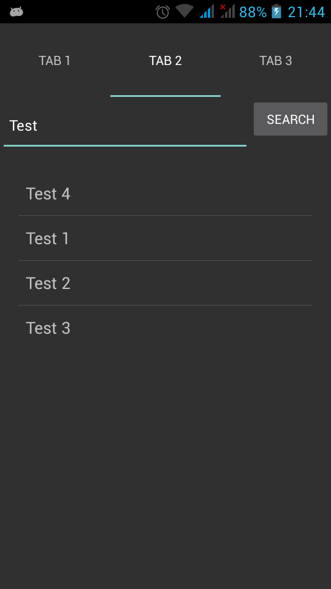
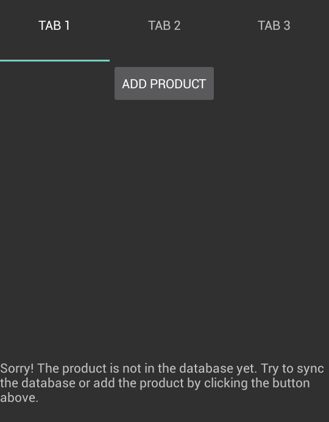
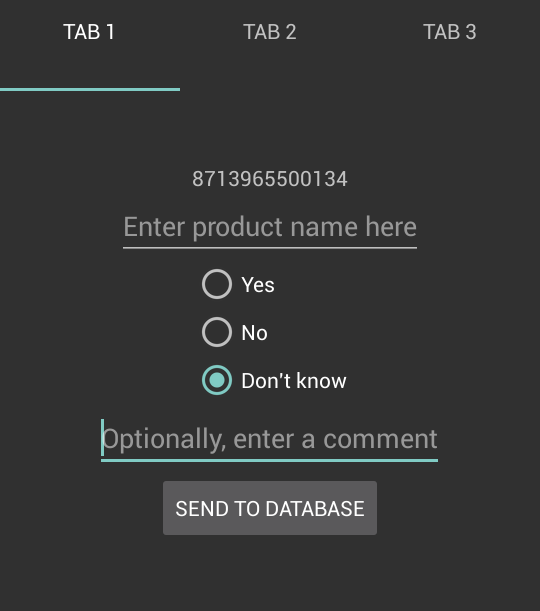
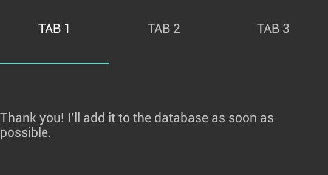

# day 2

- Use API for barcode scanner and fix that first.
- After, focus on user submitted data, because the possible data set is huge. This way I can focus on app functionality instead of filling a database.

| Index | Barcode      | Vegan | Name   | (Picture)    |
|-------|--------------|-------|--------|--------------|
| INT   | STRING       | BOOL  | STRING | JPG          |
| 1     | 123456789012 | true  | Banana | (banana.jpg) |
| 2     | 112234567890 | false | Honey  | (honey.jpg)  |

# day 3

- Made good start with prototype.
- Switched from Actionbar.Tabs to TabLayout, because the first is deprecated.
- Decided to add pictures of products later on, optionally, because it's secondary information.
- Made 'result', 'manual search' and 'information' into fragments (were Activities).

# day 4

- Decided to use [Barcode Scanner](https://github.com/zxing/zxing) via an Intent instead of making my own in an Activity.
- Finished fragments.

# day 5

- Finished barcode Intent, with prompt to install Barcode Scanner app if not installed yet. (see below)
- Decided to probably use [Parse](https://parse.com/) for the database.
- Completed Design Document.
- Updated README.

# day 6

- Spent entire day trying to figure out local and network databases with Parse. Still not done.
- Added internet connection check (for syncing database).

# day 7

- Seperated code into different classes for clarity.
- Network database is working.
- Local database is working (can download network database into local and erase the local database).
- Can scan barcode and find it (product_scanned.png)

product_scanned.png  

# day 8

- Manual search now works (manual_search_result.png)
- More tweaking on code in different classes.
- Added some TODOs on manual search (more relevant results on top, if 1 result go to resultFragment, give listItem correct colour, input case-insensitive)

manual_search_result.png  

# day 9

- Added user submitted data. User can add a product (to a seperate database) when a product is not found. (add_product.png, enter_product.png, thanks.png)
- Added seperate (but similar) database for user submissions, for easy export/import.
- MVP almost finished! (Sort of, needs a lot of tweaking).

add_product.png  

enter_product.png  

thanks.png  

# day 10

- Been busy with getting listview to work with correct background and onClick, not working yet.
- If manual search has one result, goes to ResultFragment immediately.

# day 11

- Updated DESIGN.md and README.md after week 2
- Renamed a lot of stuff for consistency
- Cleaned up code here and there
- Split ResultFragment up into 4 fragments: ResultFragment, AddFragment, EnterFragment and SentFragment

# day 12

- Busy trying to get 3 fragments (Add, Enter and Sent) inside ResultFragment, tried a lot, not working yet.

# day 13

- Finally managed to fix the fragments, now Result, Add, Enter and Sent are loaded inside ContainerFragment, which has replaced ResultFragment as the first tab.
- Also fixed the list! It now has the correct background colour and is clickable.
- Sort of messed up some parts of the clean code again, but nothing too major.

# day 14

- Added TODOs.
- Fixed (hopefully all) crashes.
- Added SharedPreferences to everything except SearchFragment, couldn't get it working there (yet) somehow.

# day 15

- Added SharedPreferences to SearchFragment.
- MemoryManagement now searches for matches with all words/barcodes in the search input and disregards whitespace.
- Switched from coloured text to coloured background for more obvious ResultFragment.
- Made search input case-insensitive.
- Sorts SearchFragment list alphabetically.

# day 16

- Cleaned up code
- Made a file containing coding rules I'll follow (STYLE.md), made up from rules [here](http://source.android.com/source/code-style.html#follow-field-naming-conventions), [here](https://github.com/futurice/android-best-practices), [here](http://stackoverflow.com/questions/12870537/android-naming-convention) and mixes of those.

# day 17

- Cleaned up more code (comments, rewriting, restyling, TODOs).
- Added some more rules to STYLE.md.