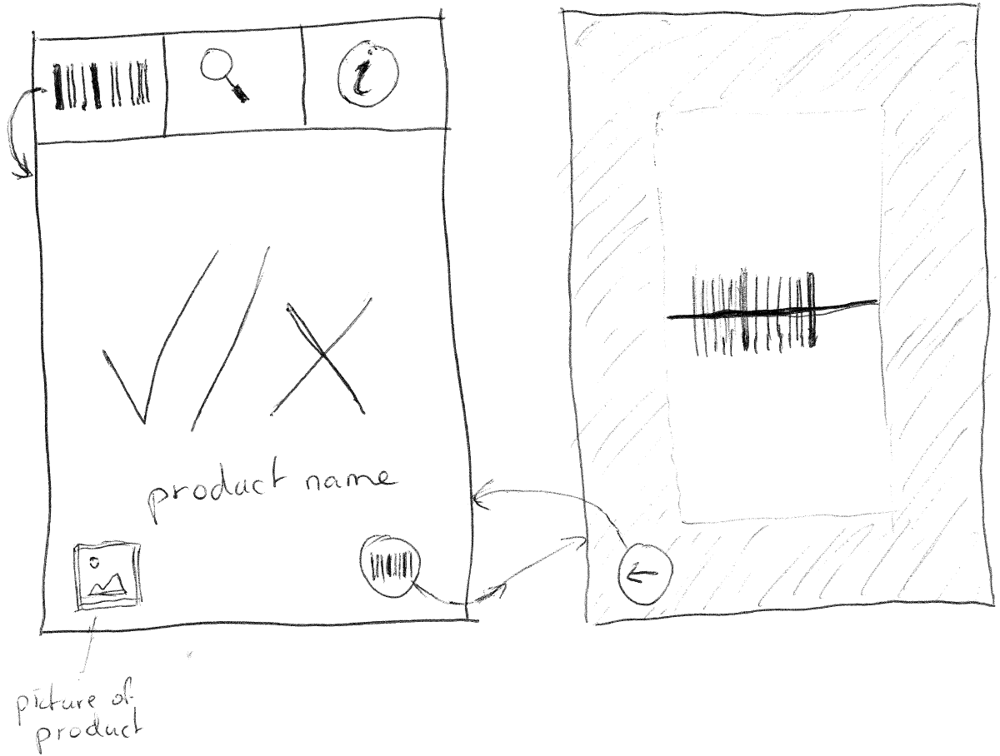
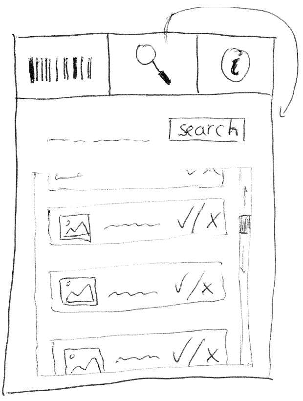

# Vegan Product Scanner
Victor den Haan - 10118039  
Programmeerproject, Minor Programmeren, UvA  

This app aims to be the solution to the question 'is this product vegan?'  
With more and more people eating plant-based foods for various reasons, both those people and their acquaintances may find themselves asking this question more often. This app will allow you to scan the barcode of a product, and it will return a simple 'yes' or 'no'.

Features:
- Barcode scanner
- Manual search

The app can be divided into the following parts:
- Barcode scanner screen (scanner.png)
- Product information screen (scanner.png)
- Manual search screen (manual_search.png)
- App information screen (information.png)
The result (yes/no, product name and picture) could be a fragment, to allow users to stay in their preferred method of searching and receive the same visual result.

Potential extras:
- Search history
- Feedback form
- Tutorial
- More/other criteria like allergies
- Bigger database (never complete)

The app requires a database with products. As a start, I will manually create one with about 50 entries. Possible sources:
- [Jumbo](https://www.jumbo.com/)
- [Albert Heijn](https://www.ah.nl/)
- [Wiki Nederlandse Vereniging voor Veganisme](https://wiki.veganisme.org/)
- [Gewoon vegan](https://gewoonvegan.nl/)
One entry contains a small picture, the product name, the product barcode and a 'vegan yes/no' boolean.

The app will possibly use [this API](https://developers.google.com/vision/barcodes-overview) for the barcode scanner.

Potential problems I foresee are related to speed (database, scanner) and usefulness (database too small to be useful). A possible solution would be to let users participate in filling the database, by allowing them to add entries (possibly after review).

One similar application exists: "Is It Vegan?". The app lets the user scan or enter a product and returns the ingredients (labelled as non-vegetarian, possibly non-vegetarian, vegetarian, possibly non-vegan and vegan) and a result based on those ingredients. This app contains almost only products from the USA, and is partly redundant in my opinion, because the user can read the ingredients themselves as well. My app will give a very clear visual cue with a simple yes/no answer, aiming (at first) on products based in the Netherlands.

  
  
