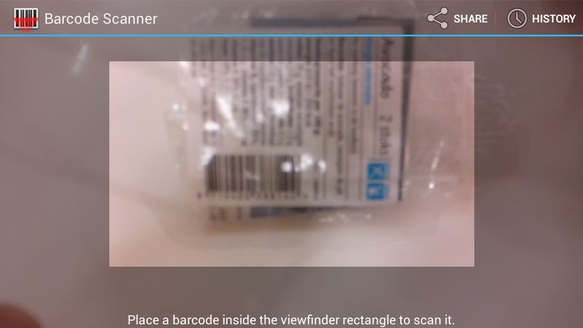
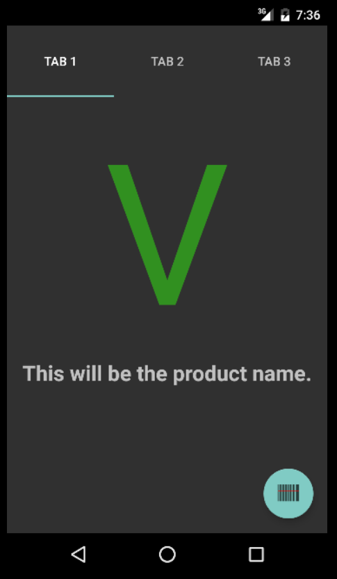
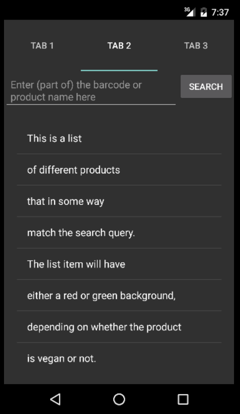
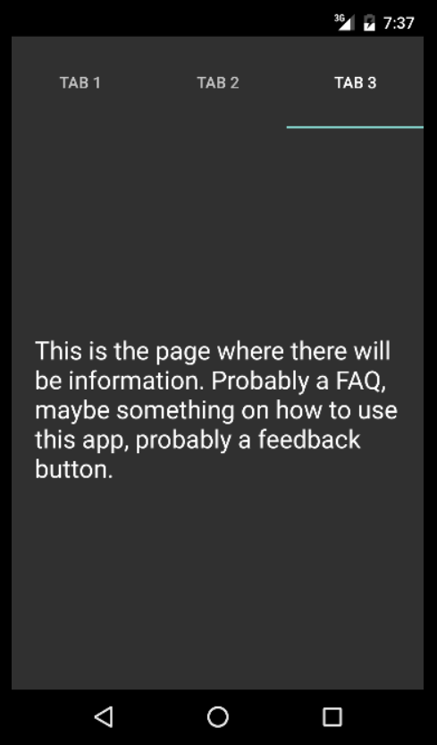

# Vegan Product Scanner
Victor den Haan - 10118039  
Programmeerproject, Minor Programmeren, UvA  

This app aims to be the solution to the question 'is this product vegan?'  
With more and more people eating plant-based foods for various reasons, both those people and their acquaintances may find themselves asking this question more often. This app will allow you to scan the barcode of a product, and it will return a simple 'yes' or 'no'.  
This app tries to be as simple and clear as possible and will therefore not include too many variables (like allergy information or vegetarianism).

Features:
- Barcode scanner
- Manual search
- Database with user submitted data

The app can be divided into the following parts:
- Barcode scanner (barcode_scanner.png)
- Product information (result_fragment.png), which includes the scanner Intent (scanner_intent.png)
- Manual search (search_fragment.png)
- App information (info_fragment.png)  

Potential extras:
- Search history
- Feedback form
- Tutorial
- Bigger database (probably never complete)

The app requires a database with products. As a start, I will manually create one with x entries. One entry contains the product name, the product barcode and a 'vegan yes/no' boolean.  
Possible sources:
- [Jumbo](https://www.jumbo.com/)
- [Albert Heijn](https://www.ah.nl/)
- [Wiki Nederlandse Vereniging voor Veganisme](https://wiki.veganisme.org/)
- [Gewoon vegan](https://gewoonvegan.nl/)  

The app will use [Barcode Scanner](https://github.com/zxing/zxing) for scanning barcodes.

Potential problems I foresee are related to speed (database, scanner) and usefulness (database too small to be useful). A possible solution would be to let users participate in filling the database, by allowing them to add entries (possibly after review).

One similar application exists: [Is It Vegan?](https://play.google.com/store/apps/details?id=net.isitvegan.androidfree) The app lets the user scan or enter a product and returns the ingredients (labelled as non-vegetarian, possibly non-vegetarian, vegetarian, possibly non-vegan and vegan) and a result based on those ingredients. This app contains almost only products from the USA, and is partly redundant in my opinion, because the user can read the ingredients themselves as well. My app will give a very clear visual cue with a simple yes/no answer, aiming (for now) at products based in the Netherlands.

barcode_scanner.png:  
  
result_fragment.png:  
  
scanner_intent.png  
  
search_fragment.png:  
  
info_fragment.png:  
